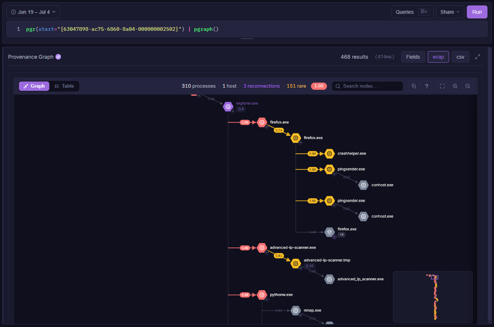

<div align="center">
  
  <h1>Bifract</h1>
  <p>Open source log management, detection, and collaboration</p>

  <a href="LICENSE"></a>
  <a href="https://github.com/zaneGittins/bifract/releases"></a>
  <a href="https://docs.bifract.io"></a>
</div>



Bifract is a log platform for security teams, built on ClickHouse for high-volume storage and search. It pairs a pipe-based query language with behavioral baselines, process provenance, and collaborative investigation.

## Query

BQL is pipe-based. Filter, then transform:

```bql
image=~powershell,pwsh,cmd
| groupby(computer_name, function=count())
| sort(_count, order=desc)
```

`=~` is contains-any against a comma-separated list. Source commands generate their own data, like the provenance graph above:

```bql
pgr(start="{63047898-ac75-6860-8a04-000000002502}") | pgraph()
```

## Features

- **Provenance graph:** `pgr()` rebuilds a process tree and attaches the file writes, connections, DNS, and injection under it, scoring rare activity and propagating it along the chain ([NoDoze](https://www.ndss-symposium.org/ndss-paper/nodoze-combatting-threat-alert-fatigue-with-automated-provenance-triage/)). Works with Sysmon, Tracee, Tetragon, or any EDR telemetry you normalize.
- **Models:** rarity, first/last seen, and volume baselines built from a BQL query and maintained at ingest, plus beacon and long-connection scoring for Zeek-style data (inspired by [RITA](https://github.com/activecm/rita)). Results join back into any search with `model_lookup()`.
- **Alerting:** cursor-based evaluation so no logs are missed across restarts, with Sigma rules synced and converted from Git.
- **Collaboration:** comment on individual logs, build investigation notebooks, publish dashboards to shared links.
- **Archive:** every log written to object storage as Parquet with Iceberg metadata, searchable in place, restorable into ClickHouse.

## Quick Start

The Linux setup wizard handles SSL, passwords, Docker Compose, and database initialization:

```bash
curl -sfL https://docs.bifract.io/install.sh | sh
```

Read [the script](https://docs.bifract.io/install.sh) first if you'd rather. Upgrade an existing install with `sudo bifract --upgrade`. For Kubernetes, see the [deployment guide](https://docs.bifract.io/getting-started/kubernetes/).

## Status

Bifract is at v0.0.3 and maintained by one developer. It's built to handle billions of logs, and the core (ingest, search, alerting) is stable. The Iceberg archive is the newest piece and the most likely to change. Endpoint behavioral analytics is off by default because the baselines run on every ingested log; leave it off if you don't collect endpoint data.

## Documentation

Full documentation at **[docs.bifract.io](https://docs.bifract.io)**, including installation guides, BQL reference, ingestion, and administration.

## Contributing

Contributions, bug reports, and feature requests are welcome via [GitHub Issues](https://github.com/zaneGittins/bifract/issues). Please be patient with response times.

Licensed under [AGPL-3.0](LICENSE).
