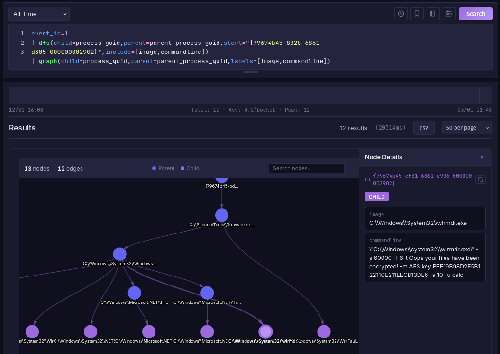

# Graph Traversal

Traverse parent-child relationships using breadth-first (`bfs`) or depth-first (`dfs`) search. Useful for tracing process trees, dependency chains, and hierarchical data.

## Syntax

```
bfs(child=field, parent=field, start="value", depth=N, include=[field1,field2])
dfs(child=field, parent=field, start="value", depth=N, include=[field1,field2])
```

| Parameter | Required | Description |
|-----------|----------|-------------|
| `child` | Yes | Field identifying each node (e.g., `process_guid`) |
| `parent` | Yes | Field referencing the parent node (e.g., `parent_process_guid`) |
| `start` | Yes | Starting node value. Quote values with special characters |
| `depth` | No | Max traversal depth (default: 10, max: 50) |
| `include` | No | Extra fields to return (e.g., `include=image` or `include=[image,command_line]`) |

**Computed fields** added to each result:

| Field | Description |
|-------|-------------|
| `_depth` | Distance from the starting node (0 = start) |
| `_path` | Full path from start node (IDs joined by ` > `) |

`bfs()` orders results by `_depth` (level by level). `dfs()` orders by `_path` (follows each chain to its end before backtracking).

!!! tip
    Pipe traversal results into `graph()` to visualize the tree as an interactive node diagram. Use `include=` to add fields, then pass them as `labels=` to annotate each node.



## Examples

Trace child processes from a starting process:
```
event_id=1 | bfs(child=process_guid, parent=parent_process_guid, start="{GUID}")
```

Include extra fields:
```
event_id=1
| bfs(child=process_guid, parent=parent_process_guid, start="{GUID}", include=[image,command_line])
| graph(child=process_guid, parent=parent_process_guid, labels=image)
```

Depth-first, limited to 3 levels:
```
event_id=1
| dfs(child=process_guid, parent=parent_process_guid, start="{GUID}", depth=3)
| table(process_guid, parent_process_guid, image, _depth, _path)
```

Pre-filter before traversal:
```
event_id=1 AND computer_name=WORKSTATION01
| bfs(child=process_guid, parent=parent_process_guid, start="{GUID}", include=image)
| graph(child=process_guid, parent=parent_process_guid, labels=image)
```
