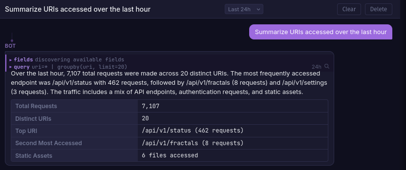

# AI Chat

LLM-powered chat assistant scoped to each fractal. It queries your logs using Quandrix, discovers fields, and presents structured findings in a conversational interface.



## Setup

Chat requires a [LiteLLM](https://docs.litellm.ai/) proxy container and an API key for at least one supported provider (OpenAI, Anthropic, etc). AI keys are not configured during initial setup; add them manually to your `.env` file after installation.

### 1. Configure a model

Edit `litellm-config.yaml` in your install directory:

```yaml
model_list:
  - model_name: bifract-chat
    litellm_params:
      model: anthropic/claude-haiku-4-5-20251001
      api_key: os.environ/ANTHROPIC_API_KEY
      drop_params: true
```

### 2. Add your API key to .env

Open the `.env` file in your install directory and add your provider key:

```bash
ANTHROPIC_API_KEY=sk-ant-...
```

`LITELLM_MODEL` controls which model is used and defaults to `bifract-chat-anthropic`. Change it to match your `model_name` if needed.

### 3. Restart the stack

```bash
docker compose up -d
```

LiteLLM runs on the internal Docker network only and is not exposed to the host.

## Features

- **Per-fractal conversations** scoped to the selected fractal's log data
- **Tool use** via `run_query` (Quandrix) and `get_fields` to explore logs
- **Streaming** responses token-by-token via SSE
- **Time range control** from a selector in the chat header
- **Multiple conversations** with create, rename, and delete support
- **Search integration** by clicking the magnifying glass on any query tool call

!!! tip
    Importing an [alert feed](../alerting/alert-feeds.md) gives the assistant context on your detection rules, enabling it to write more relevant Quandrix queries for your environment.

## Supported Providers

Any provider supported by LiteLLM works. Add entries to `litellm-config.yaml`:

```yaml
model_list:
  - model_name: bifract-chat-openai
    litellm_params:
      model: openai/gpt-4o-mini
      api_key: os.environ/OPENAI_API_KEY

  - model_name: bifract-chat-anthropic
    litellm_params:
      model: anthropic/claude-haiku-4-5-20251001
      api_key: os.environ/ANTHROPIC_API_KEY
      drop_params: true
```

Then set `LITELLM_MODEL` to whichever `model_name` you want to use.
