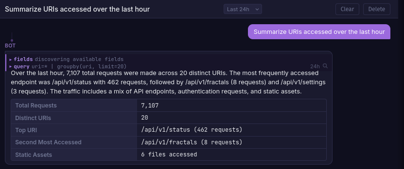

# AI Chat

LLM-powered chat assistant scoped to each fractal. It queries your logs using BQL, discovers fields, and presents structured findings in a conversational interface.



## Setup

Chat requires a [LiteLLM](https://docs.litellm.ai/) proxy container and an API key for at least one supported provider (OpenAI, Anthropic, etc). AI keys are not configured during initial setup; add them manually to your `.env` file after installation.

### 1. Add your API key to .env

Open the `.env` file in your install directory and set `LITELLM_API_KEY` to your provider key:

```bash
LITELLM_API_KEY=sk-ant-...
```

### 2. Configure a model (optional)

The default `litellm-config.yaml` uses Anthropic. To use a different provider, edit the file:

```yaml
model_list:
  - model_name: bifract-chat
    litellm_params:
      model: openai/gpt-4o-mini
      api_key: os.environ/LITELLM_API_KEY
```

Change the `model` field to match your provider. The model name must stay `bifract-chat`.

### 3. Restart the stack

```bash
docker compose up -d
```

LiteLLM runs on the internal Docker network only and is not exposed to the host.

## Features

- **Per-fractal conversations** scoped to the selected fractal's log data
- **Streaming** responses token-by-token via SSE
- **Time range control** from a selector in the chat header
- **Multiple conversations** with create, rename, and delete support
- **Search integration** by clicking the magnifying glass on any query tool call
- **Custom instructions** that shape how the assistant behaves in this deployment

### Tools

The assistant uses the same tool definitions as the [MCP server](mcp-server.md), dispatched inside the server as the signed-in user. It can reach exactly what you can reach and nothing else: every call passes the same role and scope checks as a request from the UI.

Reading tools run as the assistant needs them:

| Area | Tools |
|------|-------|
| Query | `query_logs`, `validate_bql`, `get_fields`, `get_field_stats`, `get_recent_logs`, `get_bql_reference` |
| Detections | `list_alerts`, `get_alert`, `get_alert_executions`, `get_attack_coverage`, `get_attack_gaps` |
| Investigation | `find_processes`, `get_provenance_graph` |
| Enrichment | `list_dictionaries`, `get_dictionary`, `search_dictionary`, `list_models`, `get_model`, `get_model_data` |
| Collaboration | `list_comments`, `get_log_comments`, `list_comment_tags`, `list_notebooks`, `get_notebook`, `list_saved_queries`, `list_dashboards`, `get_dashboard` |
| Libraries | `list_instruction_libraries`, `get_instruction_library`, `read_instruction_page` |
| Archive | `search_archive`, `get_archive_search`, `cancel_archive_search` |

Three more tools draw in the conversation rather than calling anything: `think`, `render_chart` and `present_results`.

The time range comes from the selector in the chat header and replaces whatever the assistant asks for, so a question cannot widen its own scan.

### Actions you approve

Tools that change something are proposed, not run. The assistant's request appears as a card showing the exact arguments, and nothing happens until you approve it:

| Tool | What approving it does |
|------|------------------------|
| `add_comment`, `add_tag`, `remove_tag` | Writes a comment or changes its tags |
| `create_notebook`, `add_notebook_section` | Writes to a notebook |
| `create_alert`, `update_alert` | Creates or changes a live detection |
| `search_archive` | Starts an archive scan, which takes minutes and reads from object storage |

The arguments are held on the server between the proposal and your answer, so what the card shows is what runs. Approving still requires the analyst role: approval does not raise your own permissions.

Some MCP tools are deliberately unavailable in chat, whether or not you would be allowed to call them yourself. Tool results contain ingested log data, which anyone who can write to a log source can influence, so an instruction hidden in a log line must not be able to reach anything with lasting effect. `delete_alert` is excluded because a removed detection fails silently; `add_dictionary_rows` because watchlists feed live detections; and the instruction-page writes because those pages become part of the assistant's own prompt, which would let one poisoned log line persist across conversations and users. Use the UI or the MCP server for those.

### Instruction Libraries

A **Library** is a set of markdown pages (organized in folders, with wiki-style `[[links]]` between them) that you attach to a conversation to give the assistant durable, environment-specific knowledge: your naming conventions, escalation procedures, known-good baselines, or triage runbooks. Manage them from the fractal's **Library** tab, and attach one or more to a conversation so the assistant can read them via `read_instruction_page`.

Libraries can also be synced from a Git repository, so runbooks stay version-controlled alongside the rest of your detection content.

!!! tip
    Importing an [alert feed](../alerting/alert-feeds.md) gives the assistant context on your detection rules, enabling it to write more relevant BQL queries for your environment.

## Supported Providers

Any provider supported by LiteLLM works. Change the `model` field in `litellm-config.yaml` to match your provider (e.g. `openai/gpt-4o-mini`, `anthropic/claude-haiku-4-5-20251001`). Set `LITELLM_API_KEY` to the corresponding API key. Some providers may need `drop_params: true` in `litellm_params`.
