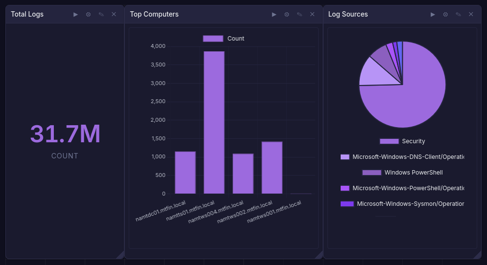
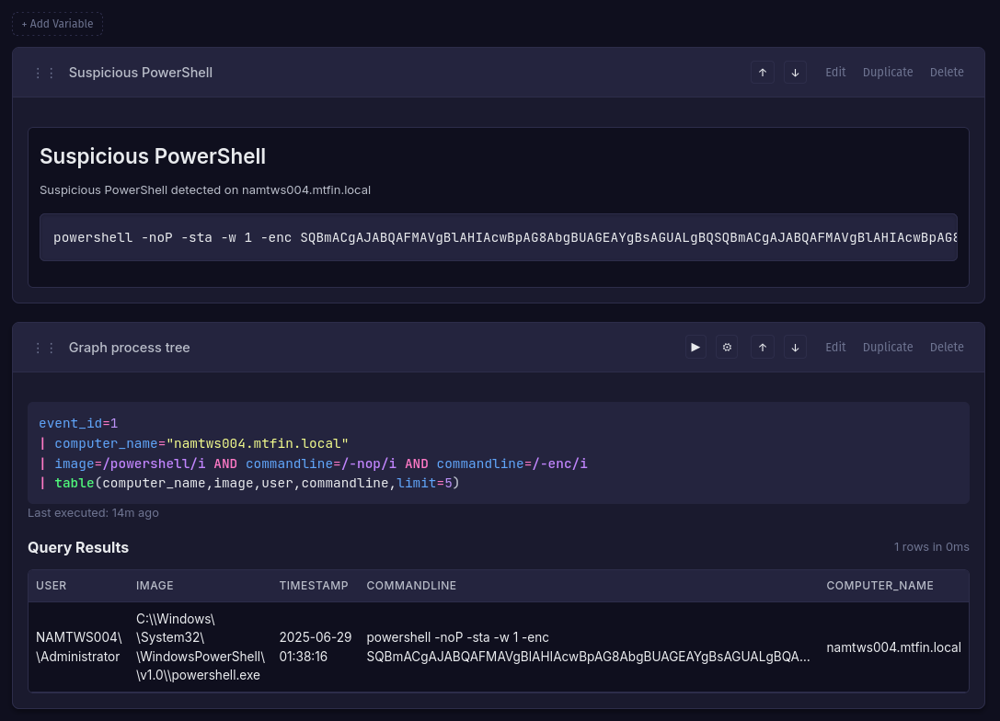

# Dashboards

Dashboards provide a grid of widgets, each running an independent Quandrix query. Use them to build monitoring views scoped to a fractal or prism.

## Creating a Dashboard

Navigate to **Dashboards** within a fractal or prism. Click **Create** and provide a name and optional description.

## Widgets

Each widget is a self-contained panel with:

- **Title** - descriptive label
- **Query** - a Quandrix query
- **Chart type** - `table`, `piechart`, `barchart`, or `graph`
- **Layout** - position and size on the 12-column grid (drag to rearrange and resize)

Widget results are cached so the dashboard loads quickly on return visits.

## Time Range

A dashboard-level time range applies to all widgets. Options include preset ranges (1h, 24h, 7d, 30d) or a custom start/end.

## Variables

Dashboard variables let you parameterize queries across widgets. Define name-value pairs, then reference them in widget queries. Changing a variable value re-runs all affected widgets.

## Export & Import

Dashboards can be exported as YAML and re-imported into the same or a different fractal. This is useful for sharing standard monitoring layouts across teams.

## Access Control

- **Viewer** - can view dashboards
- **Analyst** - can create, edit, and delete dashboards and widgets

# Notebooks

Notebooks combine markdown documentation and executable Quandrix queries in a single ordered document. They are useful for incident investigations, runbooks, and collaborative analysis.

## Creating a Notebook

Navigate to **Notebooks** within a fractal or prism. Click **Create** and provide a name and optional description.

## Sections

Notebooks contain the following section types:

- **Markdown** - formatted text for documentation, notes, and context
- **Query** - a Quandrix query that can be executed and re-run. Results are cached with the section and can be displayed as a chart
- **AI Summary** - an auto-generated summary of all other sections in the notebook (requires AI to be configured). Each notebook can have at most one AI Summary section
- **AI Attack Chain Summary** - a structured analysis that maps notebook findings to MITRE ATT&CK tactics. The executive summary is shown by default; each tactic is a collapsible section with findings that link back to the relevant comment. Available when generating a notebook from comments with the "AI Attack Chain Summary" checkbox enabled
- **Comment Context** - auto-generated when creating a notebook from comments. Shows the comment text, author, associated query, and matching log for each comment

Sections can be reordered by dragging.

## Time Range

A notebook-level time range applies to all query sections. This ensures consistent results across an investigation.

## Variables

Like dashboards, notebooks support variables that can be referenced in query sections.

## Export & Import

Notebooks export as YAML for sharing and version control.

## Generate from Comments

You can generate a notebook from tagged comments. Navigate to **Comments**, click **Generate Notebook**, and enter a tag name. Bifract collects all comments with that tag and creates a notebook containing:

1. An **AI Summary** or **AI Attack Chain Summary** section (if AI is configured). Check the "AI Attack Chain Summary" checkbox to get a MITRE ATT&CK tactic breakdown instead of a plain summary
2. A **Comment Context** section for each comment, ordered by log timestamp, showing the comment text, author, query, and pre-fetched matching log

If a notebook for the same tag already exists it is replaced. This is useful for building investigation notebooks from comments left during triage.

## Presence

Both dashboards and notebooks show which users are currently viewing, supporting real-time collaboration.
