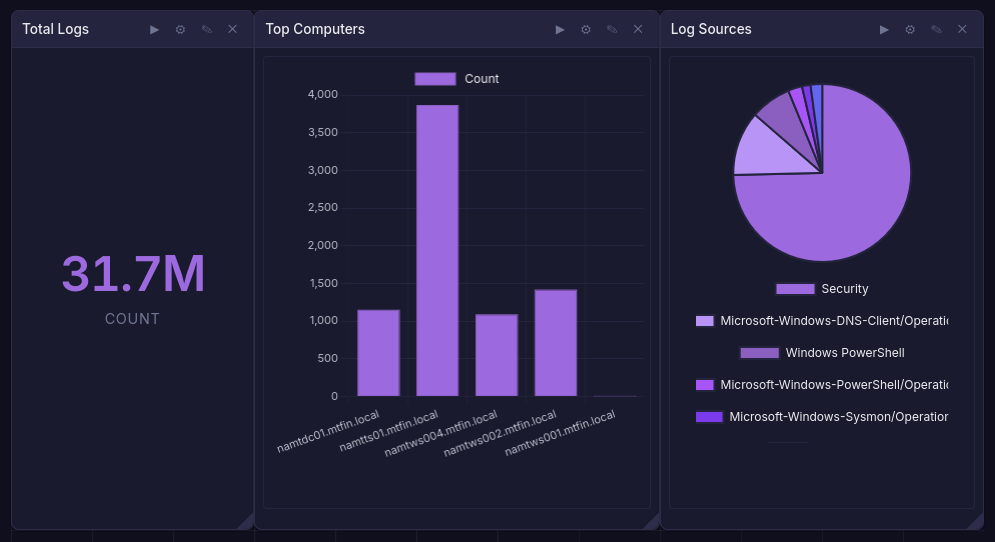
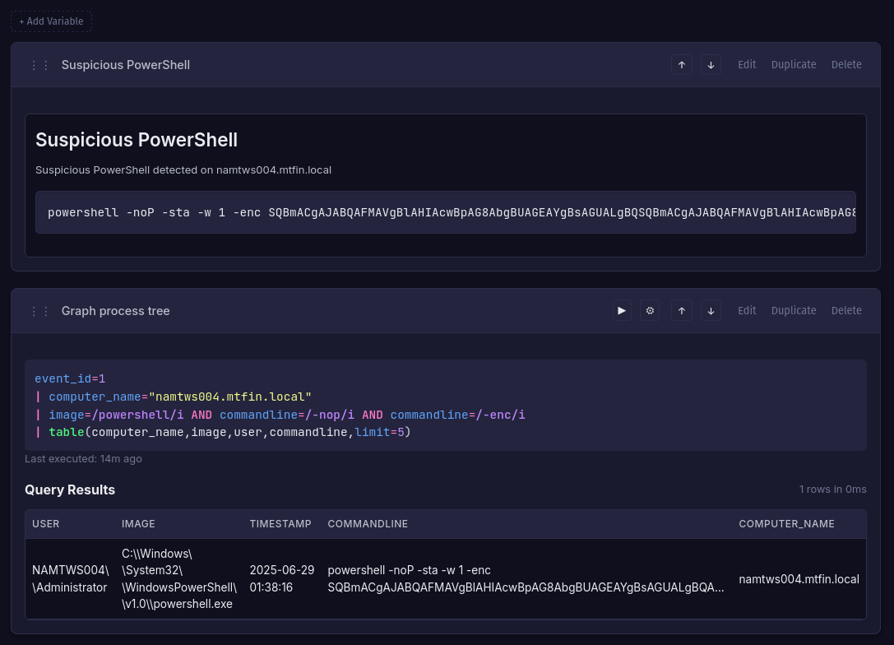

# Dashboards

Dashboards provide a grid of widgets, each running an independent BQL query. Use them to build monitoring views scoped to a fractal or prism.

## Creating a Dashboard

Navigate to **Dashboards** within a fractal or prism. Click **Create** and provide a name and optional description.

## Widgets

Each widget is a self-contained panel with:

- **Title** - descriptive label
- **Query** - a BQL query. The visualization is chosen by the query's final command, so `| piechart()`, `| timechart(...)`, `| mesh(...)` and so on each render as that chart; a query with no visualization command renders as a table
- **Layout** - position and size on a 24-column grid (see [Editing](#editing))

Available chart types are `table`, `piechart`, `barchart`, `timechart`, `singleval`, `histogram`, `boxplot`, `scatter`, `heatmap`, `graph`, `mesh`, `pgraph`, and `worldmap`. See [Visualizations](../bql/visualizations.md).

Widget results are cached so the dashboard loads quickly on return visits.

## Editing

Dashboards open in view mode. Analysts click **Edit** to change the layout, add or delete widgets, and open **Settings** (name, description, bucket timezone). **Done** returns to view mode. Layout changes save as you make them and appear for everyone viewing the dashboard.

| Action | How |
|---|---|
| Move a widget | Drag its header. Other widgets move out of the way, and everything floats up to fill gaps |
| Resize a widget | Drag its right edge, bottom edge or bottom-right corner. The badge shows the size in columns x rows |
| Edit a widget's query | Double-click its header, or use **Edit query** in the widget menu |
| Move or resize with the keyboard | Focus a header with Tab, then use the arrow keys to move or Shift + arrow keys to resize |
| Undo a layout change | **Undo** button or Ctrl+Z |

On screens narrower than 760px, widgets stack in a single column and layout editing is disabled.

## Time Range & Variables

Each dashboard has a default time range and default variable values. Every viewer, including viewers with the Viewer role, can change them for their own view:

- **Time picker**: quick ranges, any rolling window ("last N minutes, hours, days or weeks") or an absolute range.
- **Zoom**: drag across a timechart to zoom in. The zoom-out button doubles the window, and the back arrow returns to the previous range.
- **Variables**: type a value into a variable pill. The **x** on a changed pill restores its default.

These changes apply only to your view. They are kept in the URL, so reloading or sharing the link keeps them, and other viewers and shared links keep seeing the defaults. While your view differs from the defaults, the header shows **Your view** with **Reset**, and, for analysts, **Save as default**, which makes your time range and variable values the defaults for everyone.

A dashboard can also be set to refresh on an interval, which re-executes its widgets in the background so a wallboard stays current without anyone reloading the page. A view that differs from the defaults refreshes in your browser at the same interval.

## Pivots & Drilldowns

A widget can be configured so clicking a table cell, chart segment, or data point passes that row through to another dashboard or to a search. This turns a summary dashboard into an investigation entry point without duplicating queries. A drilldown into a dashboard opens it with the passed values as your view (see [Time Range & Variables](#time-range-variables)).

## Shared Links

A dashboard can be published as a read-only link that needs no login, for wallboards and status screens. Shared links serve **cached results only** and never execute BQL, so an exposed link cannot be used to run queries against your logs. The feature is off by default globally and must be enabled by an admin before any link can be created; individual links can be revoked at any time.

## Real-Time Collaboration

Dashboards and notebooks stream updates over SSE, so edits by one user appear for everyone viewing the same document, along with presence indicators showing who else is on it.

## Variables

Reference `@name` in any widget query and a variable pill for it appears above the grid, defaulting to `*`. Pills disappear when no widget references them. Changing a value re-runs the widgets; see [Time Range & Variables](#time-range-variables) for how values apply per viewer.

## Export & Import

Dashboards can be exported as YAML and re-imported into the same or a different fractal. This is useful for sharing standard monitoring layouts across teams. Exports record `grid_columns: 24`; files without it come from the earlier 12-column grid and are scaled on import.

## Access Control

- **Viewer** - can view dashboards and change the time range and variables for their own view
- **Analyst** - can also create, edit, and delete dashboards and widgets, and save a view as the default

# Notebooks

Notebooks combine markdown documentation and executable BQL queries in a single ordered document. They are useful for incident investigations, runbooks, and collaborative analysis.

## Creating a Notebook

Navigate to **Notebooks** within a fractal or prism. Click **Create** and provide a name and optional description.

## Sections

Notebooks contain the following section types:

- **Markdown** - formatted text for documentation, notes, and context
- **Query** - a BQL query that can be executed and re-run. Results are cached with the section and can be displayed as a chart
- **AI Summary** - an auto-generated summary of all other sections in the notebook (requires AI to be configured). Each notebook can have at most one AI Summary section
- **AI Attack Chain Summary** - a structured analysis that maps notebook findings to MITRE ATT&CK tactics. The executive summary is shown by default; each tactic is a collapsible section with findings that link back to the relevant comment. Available when generating a notebook from comments with the "AI Attack Chain Summary" checkbox enabled
- **Comment Context** - auto-generated when creating a notebook from comments. Shows the comment text, author, associated query, and matching log for each comment

Sections can be reordered by dragging.

## Time Range

A notebook-level time range applies to all query sections, so results stay consistent across an investigation.

## Variables

Like dashboards, notebooks support variables that can be referenced in query sections.

## Export & Import

Notebooks export as YAML for sharing and version control.
