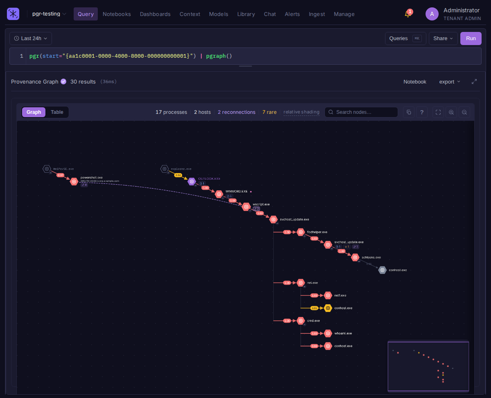

# Provenance Graph

The provenance graph (`pgr()`) reconstructs what a suspicious process did and cuts it down to what matters. Point it at a single process and it rebuilds the spawn tree, scores every file, network, DNS, and injection action by how unusual it is, and prunes the everyday noise, so a handful of suspicious actions surface instead of thousands of raw events to sift through.



## Enabling it

Provenance requires baselines built from your endpoint logs, so it is **off by default**. An admin turns it on under **Settings > General > Endpoint Analytics > Collect baselines**.

When enabled, Bifract maintains two lightweight baselines as logs arrive: process lineage (who spawned whom) and behavior frequency (how common each file, IP, and domain is across your fleet). These run on every ingested log, so leave the toggle off unless you use these features. When you re-enable it, baselines resume from that point forward.

!!! note "Requirements"
    Provenance needs an endpoint/EDR source (for example Sysmon). Set the query time range to cover the whole investigation window; lineage outside the selected range is not included.

## Required fields and categories

Provenance reads from a small set of normalized fields. Your [normalizer](normalizers.md) must map each source event to a `bifract_category` and populate the fields below (all field names are relative to the `fields` column). The graph works from whichever categories you send: `process_creation` alone builds the spawn tree, and each additional category adds that layer of activity.

Every event should also carry `computer_name` (the host) and an event `timestamp`.

| `bifract_category` | Adds | Required fields |
|--------------------|------|-----------------|
| `process_creation` | The spawn tree (required backbone) | `process_guid`, `parent_process_guid`, `image`, `parent_image`, `commandline`, `computer_name` |
| `file_write` | Files a process wrote | `process_guid`, `image`, `target_file`, `computer_name` |
| `network_connect` | Outbound network destinations | `process_guid`, `image`, `dst_ip`, `computer_name` |
| `dns_query` | Domains a process resolved | `process_guid`, `image`, `query`, `computer_name` |
| `remote_thread` | Process injection edges (opt-in, see below) | `source_process_guid`, `target_process_guid`, `image`, `target_image`, `computer_name` |
| `process_access` | Handle-access edges (opt-in, see below) | `source_process_guid`, `target_process_guid`, `image`, `target_image`, `computer_name` |

!!! note "Injection edges are opt-in"
    `pgr()` generates `file_write`, `net_connect`, and `dns_query` leaves by default. `remote_thread` and `process_access` are **not** generated unless you ask for them, because they key off `source_process_guid`, which has no skip index: including them forces an unindexed full-window scan per branch. Request them explicitly when you need them:

    ```
    pgr(start="{GUID}", include="remote_thread,process_access") | pgraph()
    ```

!!! tip "Optional fields"
    `user` (on `process_creation`) is shown in a process's detail panel, and `query_results` (on `dns_query`) lets reconnection match resolved IPs as well as domains. Neither is required for the graph to build.

These map directly to Sysmon events: `process_creation` = 1, `network_connect` = 3, `dns_query` = 22, `file_write` = 11, `remote_thread` = 8 (Sysmon CreateRemoteThread), `process_access` = 10.

## Using it

Run `pgr()` seeded on a process, then pipe to `pgraph()` to visualize:

```
pgr(start="{GUID}") | pgraph()
```

`pgraph()` also renders a plain process tree from `ptg()`:

```
ptg(start="{GUID}") | pgraph()
```

That is the same canvas with process creation only: no anomaly scoring, no file/network/DNS activity, and no reconnection, since `ptg()` reads the process-lineage table alone. Use it when you want the spawn tree quickly, or when behavioral analytics is off; use `pgr()` when you want to know which parts of that tree are unusual.

### Anomaly scoring

Every action gets an `anomaly_score` from 0 to 1, where 1 is never-seen-before and 0 is ubiquitous across your environment. Rare behavior surfaces; common noise fades. Scoring also follows the chain, so a sequence of individually-common steps (a classic living-off-the-land pattern) adds up and stands out even when no single step looks unusual on its own.

How an action is scored:

* **Host-days, not events.** Frequency counts each action once per host per day, so a process beaconing 10,000 times to one IP is one host-day, not 10,000 observations of normal behavior.
* **Leave-one-out.** The tree being scored, including reconnected trees, is subtracted from the baseline first. An action counts as common only if *other* host-days did it, so an attack never vouches for itself, even when a replayed dataset lands on a single ingest day.
* **Known source.** For a process image that has run elsewhere, the score is how rarely that source made this move on its other host-days: `winword.exe` starting its first-ever child scores 1.
* **New source.** For a binary that never ran on another host, the score is how rarely anyone else touched the target: its connection to a never-seen IP scores 1, its lookup of a shared resolver scores near 0. The binary itself stands out through the edge that started it.

Each row carries the evidence behind its score, and the graph's process and activity drawers show it as a **Why** line, for example `cmd.exe → node.exe: 0 of 1,240 other host-days · first seen today · target on 1 of 4 hosts · own 0.98, inherited +0.02`.

| Column | Meaning |
|--------|---------|
| `edge_score` | The action's own score; `anomaly_score` minus it is what the chain above added |
| `score_basis` | `transition` (known source), `new_source`, `no_source` (parent never logged), or `reconnect` |
| `edge_host_days` | Other host-days on which this source made this exact move |
| `source_host_days` | Other host-days on which this source made any move of this type |
| `source_exec_host_days` | Other host-days on which this source binary ran |
| `target_host_days` | Other host-days on which any process touched the target |
| `target_hosts`, `total_hosts` | Hosts that touched the target (including this one, capped at 256) out of the fleet |
| `first_seen` | First day the relationship was ever observed |

### Reconnection

`pgr()` also pulls in **other** process trees that share a rare artifact with the one you seeded: a file this tree wrote that another tree then executed, or the same rare external IP or domain touched by both. That is how lateral spread shows up without you hunting for it. Only artifacts that are rare across your fleet bridge, so shared CDNs, resolvers, and update servers do not reconnect everything.

Each reconnected peer arrives as its own tree on the canvas, so the number admitted is capped at the 50 strongest bridges (a peer reached through several rare artifacts ranks above one reached through a single IP). Tune it with `peers=`:

```
pgr(start="{GUID}", peers=200) | pgraph()
```

Use `reconnect=false` to show only the seeded tree.

The graph's **reconnections** stat counts linked process pairs, and reads `50 of 312` when the view is showing the strongest ones. Hovering it reports how many distinct bridges (shared artifacts) are behind those pairs, which is usually the smaller and more useful number: one rare domain touched by twenty processes is one bridge, not twenty.
