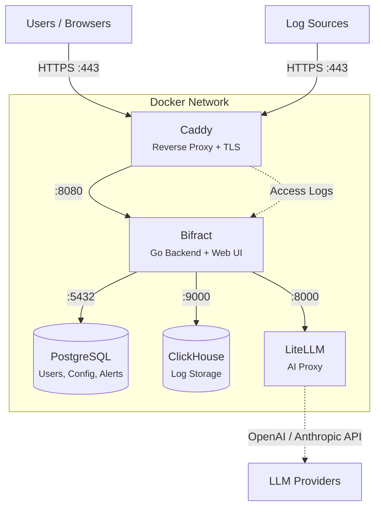

# Installation

## Quick Start

The recommended way to install Bifract is with the Linux setup wizard. It handles SSL, secure passwords, Docker Compose, and database initialization:

```bash
curl -sfL https://raw.githubusercontent.com/zaneGittins/bifract/main/scripts/install.sh | sh
```

To upgrade an existing installation (if `bifract` is already installed):

```bash
sudo bifract --upgrade
```

This automatically checks for a newer version of `bifract` itself, downloads it if available, then runs the upgrade.

## Architecture



## System Requirements

Bifract is supported on **Linux x86_64** (amd64). The installer and pre-built binaries target this architecture.

### Hardware Sizing

Recommended hardware for single-node Docker Compose deployments based on daily raw log volume.

| Daily Ingest | CPU Cores | RAM    | Profile                          |
|--------------|-----------|--------|----------------------------------|
| 10 GB        | 4         | 8 GB   | Small team, single application   |
| 50 GB        | 8         | 16 GB  | Multiple applications            |
| 100 GB       | 16        | 32 GB  | Department-level collection      |
| 250 GB       | 16        | 64 GB  | Multi-team or business unit      |
| 500 GB       | 32        | 128 GB | Enterprise-wide collection       |

For disk, plan roughly 60 GB of storage per 10 GB/day ingested at 30-day retention. ClickHouse typically achieves 7-10x compression on structured log data. SSD minimum, NVMe recommended.