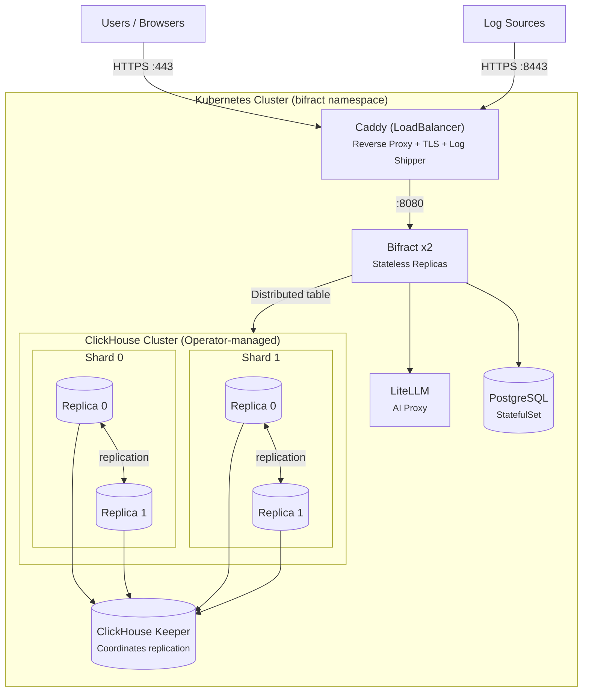

# Kubernetes Deployment

ClickHouse scales vertically on a single node exceptionally well, but when you need high availability or have outgrown the resources of a single machine, Bifract supports deploying across a Kubernetes cluster. This guide walks through deploying to a managed Kubernetes provider such as DigitalOcean DOKS, AWS EKS, or GKE.

Docker Compose remains the primary and simplest deployment method. See [Installation](installation.md) for the standard setup.

## Prerequisites

- A running Kubernetes cluster (1.28+)
- `kubectl` configured and connected to your cluster
- `helm` v3.0+ installed
- A domain name

## Architecture



## Step 1: Install ClickHouse Operator

Bifract uses the [official ClickHouse Kubernetes Operator](https://clickhouse.com/docs/clickhouse-operator/overview) to manage ClickHouse and Keeper clusters.

First, install cert-manager (required by the operator):

```bash
kubectl apply -f https://github.com/cert-manager/cert-manager/releases/download/v1.17.2/cert-manager.yaml
```

Wait for cert-manager to be ready:

```bash
kubectl -n cert-manager wait --for=condition=ready pod -l app.kubernetes.io/instance=cert-manager --timeout=120s
```

Then install ClickHouse operator:

```bash
helm install clickhouse-operator -n clickhouse-operator-system --create-namespace \
  oci://ghcr.io/clickhouse/clickhouse-operator-helm
```

Verify it's running:

```bash
kubectl -n clickhouse-operator-system get pods
```

## Step 2: Generate Manifests

Run the Kubernetes install wizard:

```bash
bifract --install-k8s
```

The wizard will prompt for:

| Setting | Description | Example |
|---------|-------------|---------|
| Domain | Your domain name | `bifract.example.com` |
| SSL mode | Let's Encrypt or custom cert | Let's Encrypt |
| IP access | Traffic restriction mode (includes mTLS option) | Allow all |
| Resource profile | Cluster sizing preset (Dev through X-Large) | Small |
| CH shards | ClickHouse shards for horizontal scaling | `1` |
| CH replicas | ClickHouse replicas per shard (2+ for HA) | `2` |
| CH storage | Storage per replica in GB | `100` |
| Output dir | Where to write manifests | `./bifract-k8s` |

The resource profile sets CPU and memory requests/limits for all components based on your expected workload. Shard and replica counts are pre-filled by the profile but can be adjusted. See [Sizing Guide](sizing.md) for details on each profile.

This generates a complete set of Kustomize manifests with secure credentials in the output directory. Save the admin password displayed at the end.

## Step 3: Deploy

```bash
kubectl apply -k ./bifract-k8s
```

Watch the pods come up:

```bash
kubectl -n bifract get pods -w
```

You should see:

- 1 PostgreSQL pod
- 1 ClickHouse Keeper pod (managed by the operator via `KeeperCluster`)
- 2 ClickHouse replica pods (managed by the operator via `ClickHouseCluster`)
- 2 Bifract pods
- 1 Caddy pod (with a log shipper sidecar)
- 1 LiteLLM pod

ClickHouse and Keeper pods may take a minute as the operator creates and configures them.

## Step 4: Configure DNS

Get the load balancer's external IP:

```bash
kubectl -n bifract get svc caddy
```

Create an A record for your domain pointing to the external IP of Caddy. Once DNS propagates, Caddy will automatically provision a Let's Encrypt certificate. You can then log in at `https://your-domain.com` with the admin credentials from Step 2.

## Verification

Check the cluster is healthy:

```bash
# Bifract health
curl https://bifract.example.com/api/v1/health

# Bifract pod logs
kubectl -n bifract logs -l app=bifract --tail=50

# ClickHouse cluster status
kubectl -n bifract exec -it bifract-ch-clickhouse-0-0-0 -- \
  clickhouse-client --query "SELECT * FROM system.clusters"

# Network policies
kubectl -n bifract get networkpolicies
```

## Scaling ClickHouse

Shard and replica counts are set during `--install-k8s` and can be changed at any time with `--reconfigure-k8s`. Replicas provide high availability within a shard. Shards distribute data across multiple nodes for increased storage capacity and query throughput.

```bash
# Scale to 2 shards with 3 replicas each (6 total ClickHouse pods)
bifract --reconfigure-k8s --dir ./bifract-k8s --shards 2 --replicas 3
kubectl apply -k ./bifract-k8s
```

This regenerates the ClickHouse cluster manifest and updates `CLICKHOUSE_HOSTS` automatically. Bifract's Distributed table routes queries across all shards and distributes writes evenly.

## Post-Deploy Configuration

Optional features are configured by editing the `bifract-secrets` Secret. The generated manifests include empty placeholders for all optional integrations. To enable a feature, populate the relevant keys and restart Bifract:

```bash
kubectl -n bifract edit secret bifract-secrets
kubectl rollout restart deployment bifract -n bifract
```

| Feature | Secret Keys | Docs |
|---------|------------|------|
| OIDC / SSO | `OIDC_ISSUER_URL`, `OIDC_CLIENT_ID`, `OIDC_CLIENT_SECRET`, `OIDC_REDIRECT_URL`, `OIDC_SCOPES`, `OIDC_DEFAULT_ROLE`, `OIDC_ALLOWED_DOMAINS`, `OIDC_BUTTON_TEXT` | [OIDC/SSO](../administration/oidc-sso.md) |
| S3 Backups | `S3_ENDPOINT`, `S3_BUCKET`, `S3_ACCESS_KEY`, `S3_SECRET_KEY`, `S3_REGION` | [Backup & Restore](../administration/backup-restore.md) |
| GeoIP Enrichment | `MAXMIND_LICENSE_KEY`, `MAXMIND_ACCOUNT_ID` | [Field Operations](../bql/field-operations.md) |
| AI Chat | `LITELLM_API_KEY` | [AI Chat](../features/ai-chat.md) |

## Upgrading

Use `--upgrade-k8s` to upgrade to a new Bifract version. This re-renders all manifests with the new image tag while preserving your secrets, resource profiles, and settings. A timestamped backup is created before any files are modified.

```bash
bifract --upgrade-k8s --dir ./bifract-k8s
```

The command will:

1. Read your existing secrets and settings from the current manifests
2. Check that the new version's container image is available
3. Back up all manifests to `.backups/<timestamp>/`
4. Re-render manifests with the new version

Apply the changes with `kubectl apply -k`. PVCs are not modified. Existing data is preserved across upgrades.

## Reconfiguring

Use `--reconfigure-k8s` to change settings without upgrading the version. This is useful for switching IP access modes, changing the domain, or picking up template improvements after a binary update.

```bash
# Switch to mTLS (generates CA automatically)
bifract --reconfigure-k8s --dir ./bifract-k8s --ip-access mtls-app

# Change domain
bifract --reconfigure-k8s --dir ./bifract-k8s --domain new.example.com

# Switch to IP-restricted access
bifract --reconfigure-k8s --dir ./bifract-k8s --ip-access restrict-app --allowed-ips "10.0.0.0/8,192.168.1.0/24"

# Re-render with no changes (picks up new templates)
bifract --reconfigure-k8s --dir ./bifract-k8s
```

Available override flags:

| Flag | Description | Values |
|------|-------------|--------|
| `--ip-access` | IP access control mode | `all`, `restrict-app`, `restrict-all`, `mtls-app` |
| `--allowed-ips` | Allowed CIDRs (comma-separated) | `10.0.0.0/8,192.168.1.0/24` |
| `--domain` | Domain name | `bifract.example.com` |
| `--shards` | ClickHouse shard count | `1`, `2`, ... |
| `--replicas` | ClickHouse replicas per shard | `1`, `2`, ... |

Like `--upgrade-k8s`, a backup is created before writing. All secrets and resource profiles are preserved. After reconfiguring, apply the changes:

```bash
kubectl apply -k ./bifract-k8s
```

## Troubleshooting

**Bifract pods crash-looping:** Check logs with `kubectl -n bifract logs <pod>`. Usually means the databases are still starting. The pods will self-recover once PostgreSQL and ClickHouse are ready.

**SSL errors / Let's Encrypt not issuing cert:** Verify DNS is pointing to the load balancer IP and that ports 80/443 are reachable. Check Caddy logs with `kubectl -n bifract logs -l app=caddy`. If Caddy attempted certificate issuance before DNS was ready, it may have cached a failed state. Restart the Caddy pod to retry:

```bash
kubectl rollout restart deployment caddy -n bifract
```