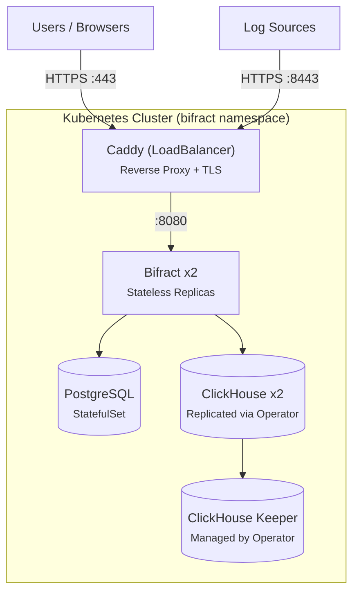

# Kubernetes Deployment

Bifract supports Kubernetes as an alternate deployment method for high availability and horizontal scaling of ClickHouse. This guide covers deploying to a managed Kubernetes cluster (e.g., DigitalOcean DOKS, AWS EKS, GKE).

Docker Compose remains the primary and simplest deployment method. See [Installation](installation.md) for the standard setup.

## Prerequisites

- A running Kubernetes cluster (1.28+)
- `kubectl` configured and connected to your cluster
- `helm` v3.0+ installed
- A domain name with DNS access

## Architecture



Traffic flow is enforced by NetworkPolicies: only Caddy accepts external traffic, only Caddy can reach Bifract, and only Bifract can reach the databases.

## Step 1: Install the ClickHouse Operator

Bifract uses the [official ClickHouse Kubernetes Operator](https://clickhouse.com/docs/clickhouse-operator) to manage ClickHouse and Keeper clusters.

First, install cert-manager (required by the operator):

```bash
kubectl apply -f https://github.com/cert-manager/cert-manager/releases/download/v1.17.2/cert-manager.yaml
```

Wait for cert-manager to be ready:

```bash
kubectl -n cert-manager wait --for=condition=ready pod -l app.kubernetes.io/instance=cert-manager --timeout=120s
```

Then install the ClickHouse operator:

```bash
helm install clickhouse-operator -n clickhouse-operator-system --create-namespace \
  oci://ghcr.io/clickhouse/clickhouse-operator-helm
```

Verify it's running:

```bash
kubectl -n clickhouse-operator-system get pods
```

## Step 2: Generate Manifests

Run the Kubernetes install wizard:

```bash
bifract --install-k8s
```

The wizard will prompt for:

| Setting | Description | Example |
|---------|-------------|---------|
| Domain | Your domain name | `bifract.example.com` |
| SSL mode | Let's Encrypt or custom cert | Let's Encrypt |
| IP access | Traffic restriction mode | Allow all |
| CH replicas | ClickHouse replicas (2+ for HA) | `2` |
| CH storage | Storage per replica in GB | `100` |
| Output dir | Where to write manifests | `./bifract-k8s` |

This generates a complete set of Kustomize manifests with secure credentials in the output directory. Save the admin password displayed at the end.

## Step 3: Deploy

```bash
kubectl apply -k ./bifract-k8s
```

Watch the pods come up:

```bash
kubectl -n bifract get pods -w
```

You should see:

- 1 PostgreSQL pod
- 1 ClickHouse Keeper pod (managed by the operator via `KeeperCluster`)
- 2 ClickHouse replica pods (managed by the operator via `ClickHouseCluster`)
- 2 Bifract pods
- 1 Caddy pod

ClickHouse and Keeper pods may take a minute as the operator creates and configures them.

## Step 4: Configure DNS

Get the load balancer's external IP:

```bash
kubectl -n bifract get svc caddy
```

Create an A record for your domain pointing to the `EXTERNAL-IP`. The IP may take 1-2 minutes to be provisioned.

Once DNS propagates, Caddy will automatically provision a Let's Encrypt certificate. You can then log in at `https://your-domain.com` with the admin credentials from Step 2.

## Verification

Check the cluster is healthy:

```bash
# Bifract health
curl https://bifract.example.com/api/v1/health

# Bifract pod logs
kubectl -n bifract logs -l app=bifract --tail=50

# ClickHouse cluster status
kubectl -n bifract exec -it bifract-ch-clickhouse-0-0-0 -- \
  clickhouse-client --query "SELECT * FROM system.clusters"

# Network policies
kubectl -n bifract get networkpolicies
```

## Updating Bifract

After pushing a new container image, restart the deployment to pull it:

```bash
kubectl rollout restart deployment bifract -n bifract
```

## Troubleshooting

**Bifract pods crash-looping:** Check logs with `kubectl -n bifract logs <pod>`. Usually means the databases are still starting. The pods will self-recover once PostgreSQL and ClickHouse are ready.

**ClickHouse pods stuck in Pending:** Run `kubectl -n bifract describe pod <pod>` and check for PVC/storage class issues. Most managed Kubernetes providers have a default storage class that works automatically.

**SSL errors / Let's Encrypt not issuing cert:** Verify DNS is pointing to the load balancer IP and that ports 80/443 are reachable. Check Caddy logs with `kubectl -n bifract logs -l app=caddy`. If Caddy attempted certificate issuance before DNS was ready, it may have cached a failed state. Restart the Caddy pod to retry:

```bash
kubectl rollout restart deployment caddy -n bifract
```

**ClickHouse `KEEPER_EXCEPTION` or connection timeouts:** Usually a network policy issue. Verify the policies are applied and that pod labels match:

```bash
kubectl -n bifract get networkpolicies
kubectl -n bifract get pods --show-labels
```

The ClickHouse pods should have `app.kubernetes.io/instance=bifract-ch-clickhouse` and Keeper pods should have `app.kubernetes.io/instance=bifract-keeper-keeper`.

**Password mismatch after regenerating manifests:** If you re-run `--install-k8s` (which generates new passwords) but the databases still have data from a previous deployment, the credentials will not match. Delete the database PVCs and reapply:

```bash
# PostgreSQL
kubectl -n bifract delete statefulset postgres
kubectl -n bifract delete pvc postgres-data-postgres-0
# ClickHouse
kubectl -n bifract delete clickhousecluster bifract-ch
kubectl -n bifract delete pvc -l app.kubernetes.io/instance=bifract-ch-clickhouse
# Keeper
kubectl -n bifract delete keepercluster bifract-keeper
kubectl -n bifract delete pvc -l app.kubernetes.io/instance=bifract-keeper-keeper
# Reapply
kubectl apply -k ./bifract-k8s
```

## Cleanup

```bash
kubectl delete -k ./bifract-k8s
```

This removes all Bifract resources but preserves PersistentVolumeClaims. To fully clean up storage:

```bash
kubectl -n bifract delete pvc --all
kubectl delete namespace bifract
```
