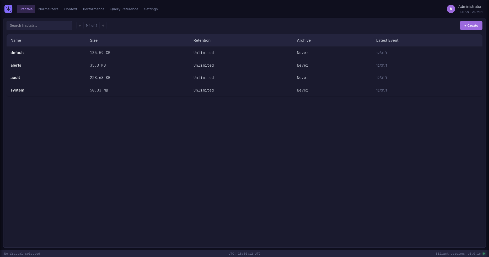

# Bifract Documentation

Bifract is an open source log management, detection, and collaboration platform built for security teams.

It leverages ClickHouse for log storage, PostgreSQL for configuration, and provides a pipe-based query language that is well suited for security investigations.

## Where to Start

- **New to Bifract?** Start with [Installation](getting-started/installation.md)
- **Deploying on Kubernetes?** See [Kubernetes](getting-started/kubernetes.md) and [Sizing Guide](getting-started/sizing.md)
- **Sending logs?** See [Ingestion](ingestion/overview.md)
- **Writing queries?** Learn [BQL basics](bql/basics.md)
- **Setting up alerts?** Read [Alerting](alerting/alerts.md)
- **API integration?** Jump to the [API Reference](api/authentication.md)

---

Bifract is licensed under the [GNU Affero General Public License v3.0](https://github.com/zaneGittins/bifract/blob/main/LICENSE).
